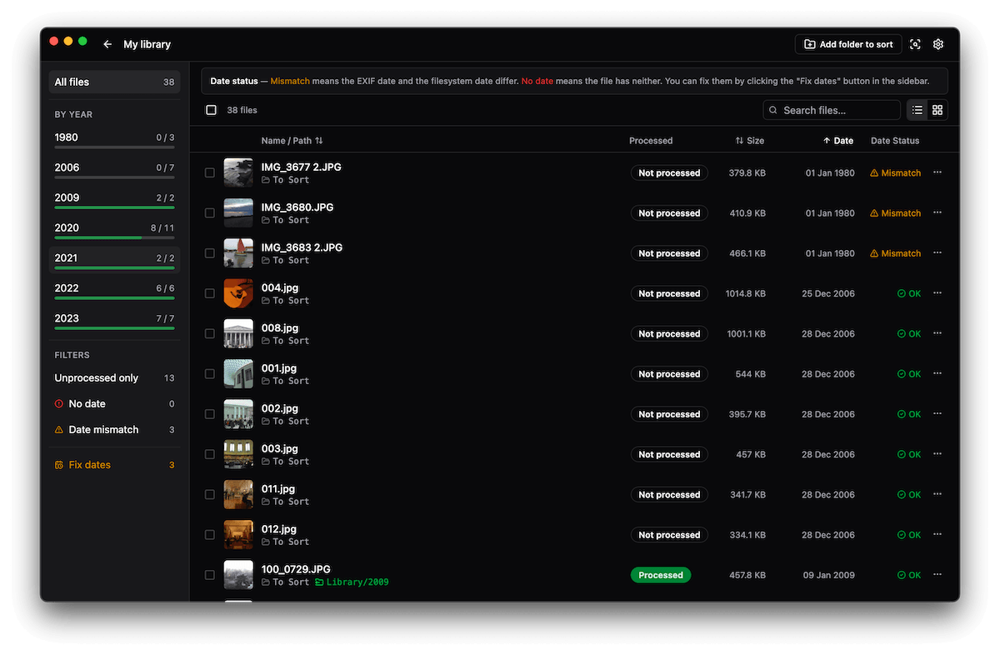

# Souvenirs

A desktop app to sort your photos and videos by year. Point it at one or more source folders, pick a destination, and it organizes everything into clean year-based folders — with automatic EXIF date detection and date-fix support.




## Features

- **Session-based workflow** — create named sessions, each with its own source folders and destination
- **Automatic date detection** — reads EXIF metadata from photos and videos via ExifTool
- **Date mismatch detection** — flags files where the EXIF date and filesystem date differ
- **Bulk date fix** — review and fix mismatched or missing dates before copying
- **Copy or move** — choose whether to keep originals or move them
- **Duplicate detection** — identifies files already present at the destination
- **Preview before acting** — review the full list of actions grouped by year before committing
- **Progress tracking** — live progress during copy/move with per-file status
- **Gallery & lightbox** — grid view grouped by year with full-screen lightbox, prev/next navigation, and media info; click to browse, select to batch-act
- **Video preview** — plays MP4, MOV, and other formats in the built-in player; HEVC/MJPEG/ProRes files are automatically transcoded to H.264 on first open via ffmpeg (cached for subsequent views)
- **HEIC support** — thumbnails and lightbox preview for HEIC/HEIF images via macOS `sips`
- **Thumbnail generation** — image and video thumbnails via Sharp, cleaned up when a session is deleted
- **Light/dark theme** — persisted preference, not tied to OS setting
- **Persistent sessions** — resume where you left off; sessions survive app restarts

## Tech Stack

| Layer | Tech |
|---|---|
| Framework | [Electron](https://electronjs.org) + [electron-vite](https://electron-vite.org) |
| UI | [React 19](https://react.dev) + [TypeScript](https://typescriptlang.org) |
| Styling | [Tailwind CSS v4](https://tailwindcss.com) + [shadcn/ui](https://ui.shadcn.com) |
| State | [Zustand](https://github.com/pmndrs/zustand) |
| EXIF | [exiftool-vendored](https://github.com/photostructure/exiftool-vendored.js) |
| Thumbnails | [Sharp](https://sharp.pixelplumbing.com) |
| Video transcoding | ffmpeg (optional, for HEVC/MJPEG/ProRes preview) |
| Persistence | [electron-store](https://github.com/sindresorhus/electron-store) |

## Getting Started

### Prerequisites

- Node.js 20+
- macOS (primary target; Windows/Linux builds available but untested)
- [ffmpeg](https://ffmpeg.org) (optional) — required for video preview of HEVC, MJPEG, and ProRes files (`brew install ffmpeg`)

### Install

```bash
npm install
```

### Development

```bash
npm run dev
```

### Build

```bash
# macOS
npm run build:mac

# Windows
npm run build:win

# Linux
npm run build:linux
```

## Usage

1. **Create a session** — give it a name, add one or more source folders, and set a destination folder
2. **Scan** — the app reads EXIF data and generates thumbnails for all media files found
3. **Explore** — browse files in list or grid view grouped by year; click a file to preview it in the lightbox (images and videos), or select files for bulk actions; filter by status (unprocessed, no date, date mismatch)
4. **Fix dates (optional)** — use the Date Fix page to correct EXIF/filesystem mismatches before copying
5. **Preview** — review the copy/move plan grouped by destination year folder
6. **Copy or Move** — execute the operation with live progress

## Project Structure

```
src/
  main/          # Electron main process
    ipc/         # IPC handlers (scanner, copy, sessions)
  preload/       # Context bridge
  renderer/      # React app
    pages/       # Page components (Home, Explorer, Preview, DateFix, Settings, Setup)
    store/       # Zustand stores (session, files, ui)
    components/  # UI components (shadcn/ui)
  shared/        # Shared TypeScript types
```

## License

MIT
